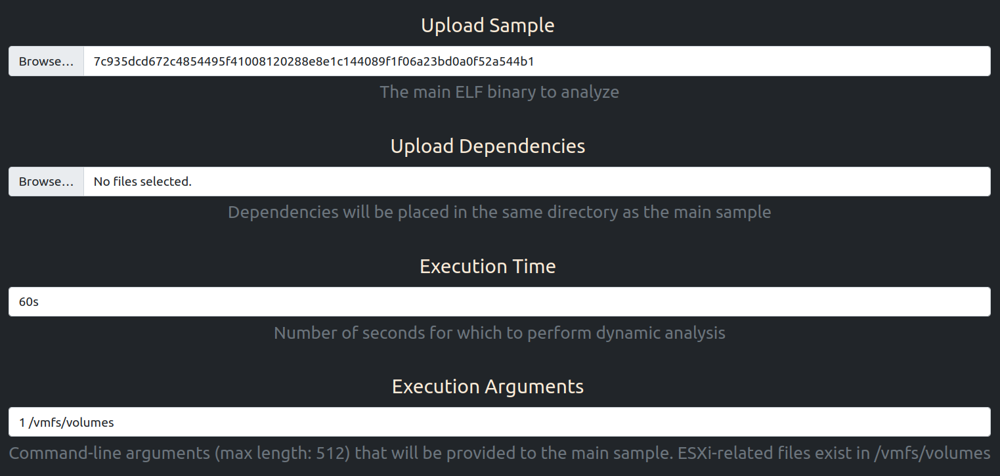
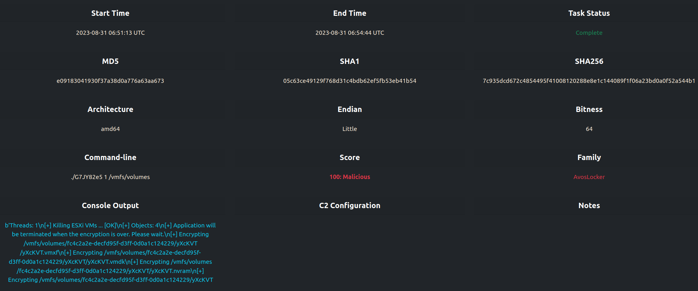
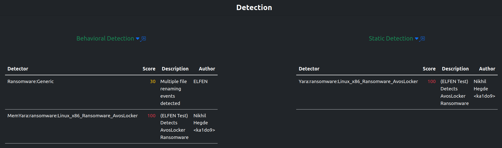
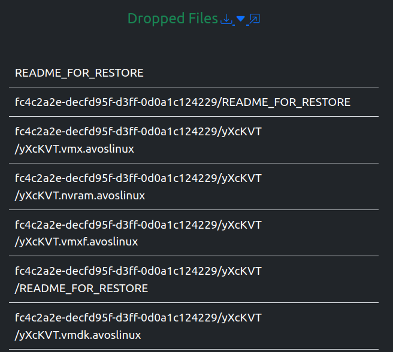
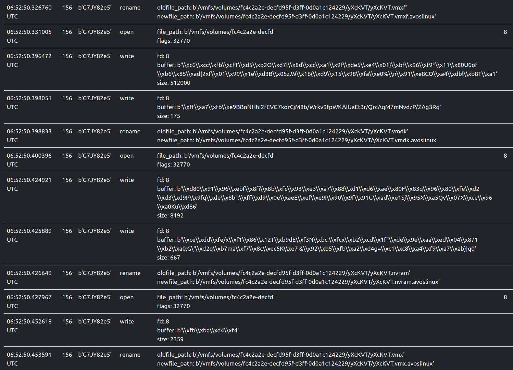
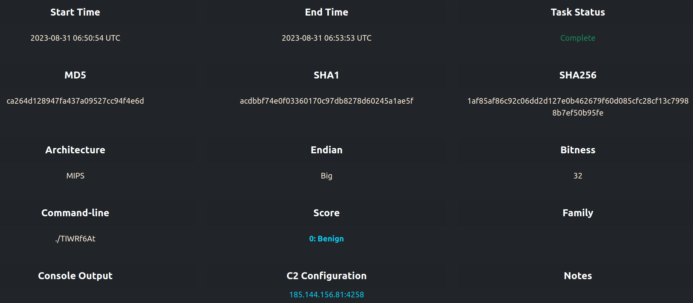

# ELFEN: Linux Malware Analysis Sandbox

## 64-bit amd64 little-endian AvosLocker Ransomware

AvosLocker sample submission with command-line arguments:

Task metadata:

Family detection with YARA rules and Python behavioral detectors:

Files dropped during dynamic analysis:

File renaming events during dynamic analysis:

## 32-bit MIPS big-endian Mirai Botnet

Task metadata with C2 Information:

